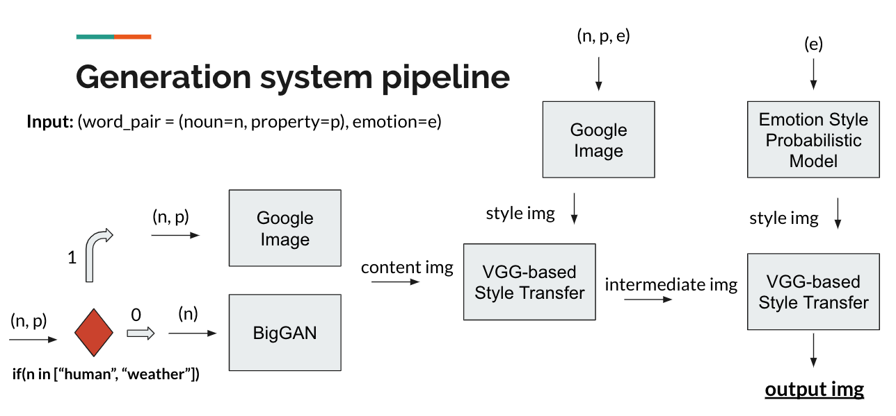
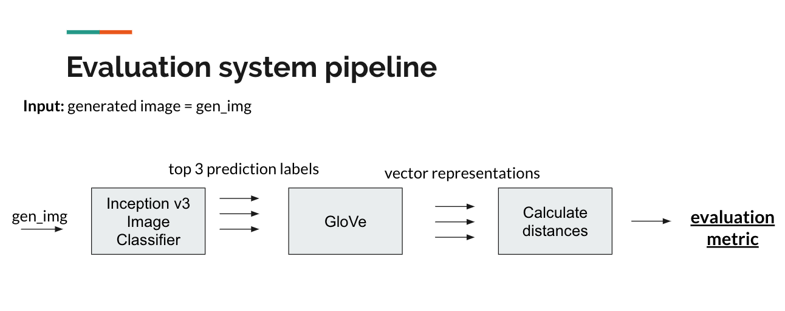
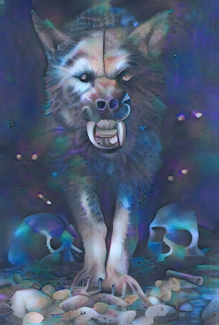
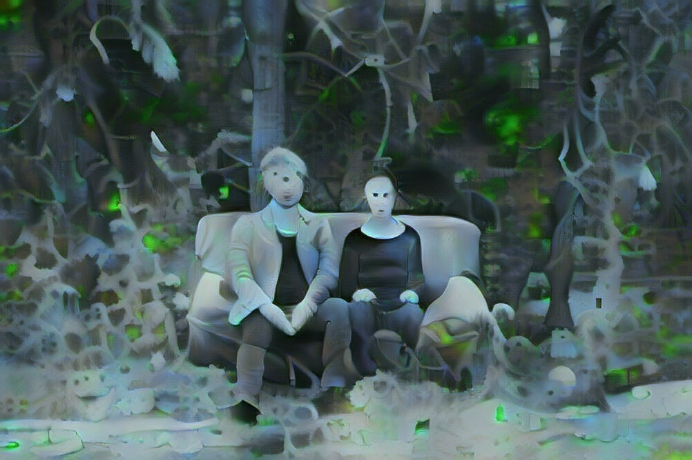
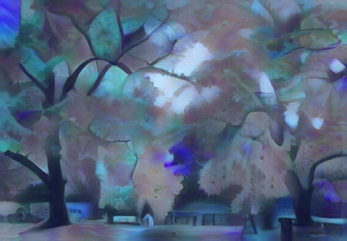
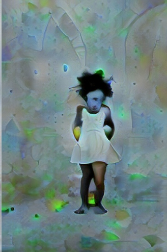
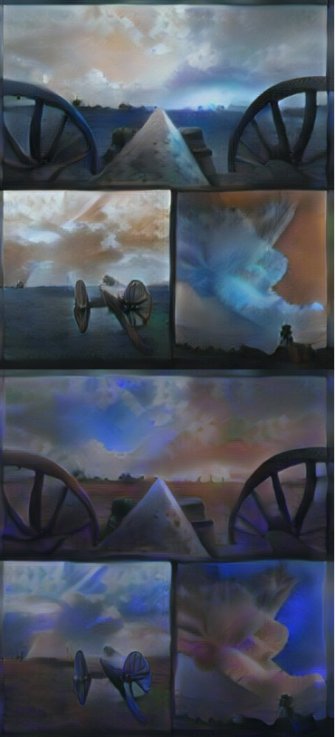
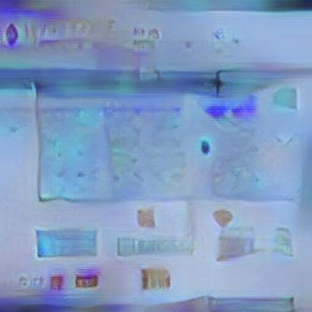

# GAN-based visual method computational creativity, using style transfer

Computational Creativity group project built by: Mateusz Gierlach, Moritz Lange, Andrei-Daniel Comanescu, Tafseer Ahmed.

## Introduction
The creative system built by our group produces images. Its goal is to produce images that have artistic value, for example resembling paintings, while still containing recognizable real-world objects. In other words, they should not resemble abstract art.

The basic principle our software is built on is the style transfer technique. This means a style, extracted from a style image, is applied to a content image. The resulting output image then contains what is visible in the content image, but drawn in the style of the style image.

## System structure

1) Generation side

2) Evaluation side

## Results produced by our creative system

1)

2)

3)

4)

5)

6)

## Full implementation description
The basic building blocks of our software have been taken from various sources. In this document, the project components that have not been set up by us (and are not available via pip) have been linked to their sources.

Our software first samples, randomly, one of the word pairs from the input it gets. Based on this, a content image is generated. There are two methods to generate a content image:

We have implemented the option to use BigGAN, a recent GAN trained on ImageNet categories. If the user chooses to use the GAN (the user has to decide this at run time, because the GAN entails higher RAM requirements), and if the noun keyword is either “location”, “activity” or “animal”, then the GAN creates the content image.
We have assigned each of the ImageNet categories, for which BigGAN can create an image, to one of those three nouns. According to the noun, one of the related ImageNet categories is sampled randomly and a respective image with resolution 256x256 is generated. How realistic this image looks is adjusted by a truncation value, which we have chosen to be small. With this we ensure that an object of the original ImageNet category is still clearly visible in the picture.

There are no ImageNet categories for “weather” or “human” and hence the BigGAN can create no such picture. So if the noun is “weather” or “human”, or if the user decides against using the GAN, a content image is instead taken from Google.
This is done by Google image search. The search query will in this case also take into account the property keyword from the word pair. The search term for the Google search will then be “noun property photograph -text -stock”. The last three words in this query are fixed and significantly improve the probability of only getting original photographs without text.
A couple of further parameters are set, so that the images will be of medium size and in jpg format. Of the first 100 images Google suggests, one is randomly picked and then downloaded.

At this stage we have a content image.

Next, the first of two style transfers is conducted. As a style image, an image is again fetched from Google. This time, the search term is “noun property emotion abstract art painting -text -stock”. The last five words are fixed, the reasoning here being the same as described above for the content image. The process of getting a  random of the first 100 images suggested by Google is also the same.
Now a style transfer network takes the style from the Google-based style image and applies it to the content image. This process is carefully adjusted in intensity, so that there is a clear change to the content image, but the style from the style image at the same time does not consume everything visible in the content image.
The output of this process is our intermediate output image.

After that, a second style transfer takes place. This time, we sample the style image ourselves. Based on the emotion keyword, a colour distribution and certain shapes are chosen. For example for “happiness”, the shapes are ellipses and the colours are yellow. For “disgust”, the shapes are polygons in shades of green and brown. These are randomly drawn on an empty canvas.
The so produced generated style image is then applied to the intermediate output image. For that, the same style transfer network and same rules as before are used.
The output of this process is our final output image. It has a style from the Google-based style image and its colours are influenced by the generated style image.
Since the second style transfer only makes small adjustments and does not shift the colour distribution by much, the colours in the final output image are not the same as in the generated style image. Instead, they are somewhere between those in the intermediate output image and the generated style image.

Initially, we wanted to only use one style transfer based on our generated style image. But it turned out that the styles in the generated images are always very similar from the viewpoint of the style transfer network, so they would not lead to enough diversity in the output images. That is why we added the Google-based style transfer.

The evaluation process, finally, tries to determine whether there is something, some object, in the final output image which can be recognized. Based on empirical tests on how to best detect an object in an image without having constraints on what the object is, we came up with following solution:
	Google’s Inception v3 network, pretrained on ImageNet pictures, tries to predict what is visible in the final output image. The top three predictions are then taken, and converted into vectors. This is done based on a pre-trained GLoVe word-embeddings instance that we have adjusted to our needs. The distances between the vectors are subsequently calculated to see how similar the top predictions are in meaning. The average of these distances is shifted and put into a sigmoid, to achieve values between 0 and 1 which over many runs average out to 0.5.

Another evaluation is arguably done with the images fetched from Google. Initially we wanted to implement some text recognition module to make sure the images we find on Google do not contain text. But it turned out that it is more time efficient and in fact even more effective to outsource this evaluation to Google, bypassing the keywords “-text -stock”.

Our software in principle supports generating multiple images and choosing the one with the highest evaluation to be returned. We have also implemented but then abandoned a history feature, where the software conducts the first style transfer based on the last run’s final output image instead of an image from Google.
